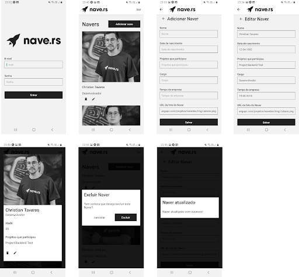

# Navedex-app
APP de um sistema web para visualização e criação dos navers, com autenticação e possuindo informações como: nomes, idades, cargos, tempo de empresa e projetos que participa. A documentação completa da api desenvolvida pode ser acessada clicando aqui

# Status do projeto 

- [ ] Em desenvolvimento
- [x] feito

## Features🔥
- Login 
- Cria Naver
- Editar Naver
- Deletar Naver
- Fetch Naver

##  Telas


## Requirements
- [Node](https://nodejs.org) `6.x` ou  mais recente
- [Expo](https://docs.expo.dev/) para desenvolvimento
- [Android Studio](https://developer.android.com/studio/index.html) para desenvolvimento

# Get Started


#### 1. Installation

No prompt de comando execute os seguintes comandos

```sh
$ git clone https://github.com/claudionhangapc/mobile-app-navedex.git

$ cd mobile-app-navedex.git/

$ npm install

$ expo start

```

#### 2. Login User

```
user: testepc@gmail.com

password: nave1234

```

